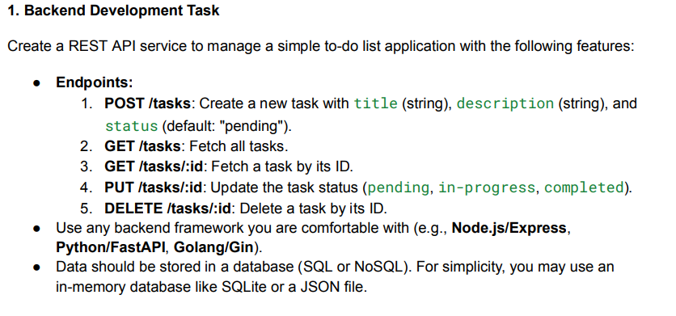

Assignment Submission for Software Development Trainee
BYTIVE TECHNOLOGIES PVT LTD
Backend Developer

Project Overview
This project contains two routes to manage tasks:

/tasks: This route uses MongoDB to store and manage tasks. If you already have MongoDB installed locally or a MongoDB Atlas cluster set up, replace the URL with your database connection string.

/jsontasks: This route uses a local tasks.json file to read and write data, which is useful for simpler use cases or if you're unable to set up MongoDB.

Note:
If you do not have MongoDB installed or face issues while setting up the MongoDB route, you can use the /jsontasks route as an alternative. It allows you to work with the application without needing a database, by simply reading and writing data to a local JSON file.

Prerequisites
Before starting the project, ensure you have the following:

Node.js installed on your machine.
MongoDB installed locally, or a MongoDB Atlas cluster set up for online usage (only for the /tasks route).
npm (Node Package Manager) for installing dependencies.

Setup Instructions
1. Install Dependencies
To begin, navigate to the project’s root folder in your terminal and run the following command to install all necessary dependencies:

npm install

2. Start the Server
Once the dependencies are installed, start the server using the following command:

npm start

This will run the server locally and expose the routes defined in the project.

3. Database Configuration
MongoDB Route (/tasks): If you are using MongoDB locally, ensure that it is properly set up and running on your machine. If you are using MongoDB Atlas, replace the database connection URL in the project with your own MongoDB URL.

Local JSON Route (/jsontasks): This route reads and writes data from a tasks.json file located in the root directory of the project. Make sure the file exists and contains data formatted in JSON. This option is ideal if you do not have MongoDB or are having trouble setting it up.

4. Testing the Endpoints
You can test the following endpoints using tools like Postman or any HTTP client:

POST /tasks: To create a new task. Requires title and description in the request body.
GET /tasks: To fetch all tasks stored in MongoDB.
GET /tasks/:id: To fetch a specific task by its ID.
PUT /tasks/:id: To update a task's status. Allowed statuses are: pending, in-progress, completed.
DELETE /tasks/:id: To delete a task by its ID.
GET /jsontasks: To fetch all tasks stored in the tasks.json file.
POST /jsontasks: To create a new task using the local JSON file.
PUT /jsontasks/:id: To update a task's status in the JSON file.
DELETE /jsontasks/:id: To delete a task from the tasks.json file.